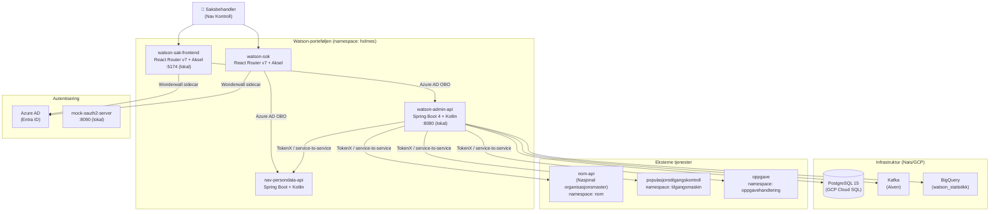

# Watson — Arkitekturkart

Overordnet systemkart for Watson-porteføljen. Oppdateres ved større arkitekturendringer.

---

## Komponentkart



---

## Autentisering og tilgang

Alle Watson-applikasjoner bruker **Azure AD** med **Wonderwall sidecar** for autentisering av saksbehandlere.

| Tjeneste | Autentisering | Tilgangsgrupper |
|----------|--------------|----------------|
| watson-sak-frontend | Azure AD Sidecar (Wonderwall) | Basic + Utvidet |
| watson-sok | Azure AD Sidecar (Wonderwall) | Basic + Utvidet |
| watson-admin-api | token-validation-spring (Azure AD) | Basic + Utvidet |
| nav-persondata-api | Azure AD OBO | Delegert fra kallende tjeneste |

### Tilgangsgrupper

| Gruppe | AD-navn | Tilgang |
|--------|---------|---------|
| Basic | `0000-GA-kontroll-Oppslag-Bruker-Basic` | Søk og oppslag |
| Utvidet | `0000-GA-kontroll-Oppslag-Bruker-Utvidet` | Full saksbehandling |

---

## Dataflyt: Kontrollsak

```
Saksbehandler
  → watson-sak-frontend (React)
  → watson-admin-api (REST + Azure AD OBO)
    → PostgreSQL (lagring av kontrollsak)
    → populasjonstilgangskontroll (verifiser tilgang til bruker)
    → nav-persondata-api (hent persondata og ytelser)
    → nom-api (hent organisasjonsinfo)
    → oppgave (opprett/oppdater oppgave)
    → Kafka (hendelse publisert)
    → BigQuery (statistikk)
```

---

## Dataflyt: Brukeroppslag

```
Saksbehandler
  → watson-sok (React)
  → nav-persondata-api (REST + Azure AD OBO)
    → eksterne registre (persondata, ytelser, arbeidsforhold)
```

---

## Lokal utviklingsarkitektur (Tilt + kind)

```
kind-kluster (watson)
├── postgres:5432          ← GCP Cloud SQL-erstatning
└── mock-oauth2-server:8090 ← Azure AD-erstatning

Lokale prosesser (utenfor kind)
└── watson-admin-api:8080   ← ./gradlew bootRun (SPRING_PROFILES_ACTIVE=local)
```

> Alle Watson-tjenester skal på sikt startes via Tilt. `Tiltfile` utvides gradvis.

---

## Nais-konfigurasjon (produksjon)

| Parameter | Verdi |
|-----------|-------|
| Namespace | `holmes` |
| Kluster dev | `nav-dev-gcp` |
| Kluster prod | `nav-prod-gcp` |
| Database | GCP Cloud SQL PostgreSQL 15 |
| Kafka pool | `nav-prod` / `nav-dev` |

### accessPolicy (watson-admin-api)

Inbound:
- `watson-sak` (namespace: holmes)
- `azure-token-generator` (namespace: nais) — for testing

Outbound:
- `nom-api` (namespace: nom)
- `populasjonstilgangskontroll` (namespace: tilgangsmaskin)
- `oppgave` (namespace: oppgavehandtering)
- `nav-persondata-api` (namespace: holmes)

---

## Videre lesning

- [docs/domene/ordbok.md](../domene/ordbok.md) — domenebegreper
- [watson-admin-api nais.yaml](https://github.com/navikt/watson-admin-api/blob/main/.nais/nais.yaml) — full Nais-konfig
- [Nais docs](https://docs.nais.io) — plattformdokumentasjon
